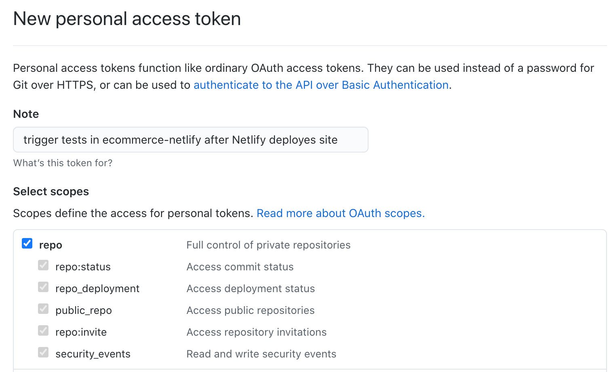
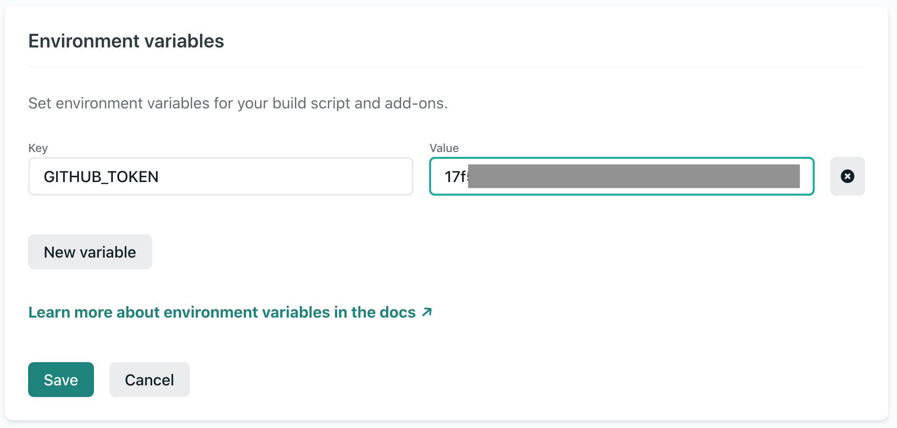
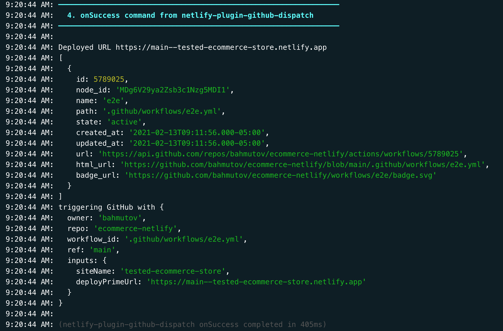
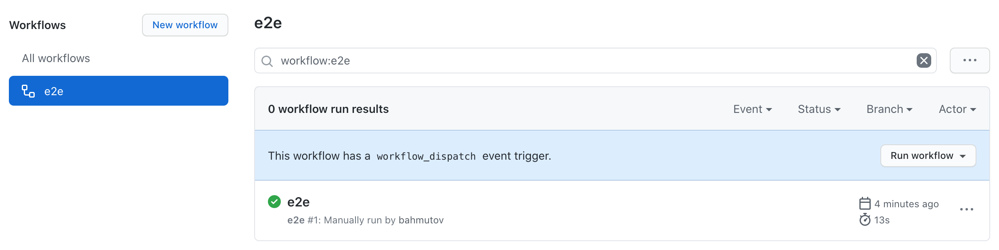

# netlify-plugin-github-dispatch
[![ci status][ci image]][ci url] [![e2e status][e2e image]][ci url]
> Playing with Netlify to trigger GitHub Actions after the deploy finishes

## Install and use

1. Create a [new personal GitHub Token](https://github.com/settings/tokens/new) with "repo" permissions. This token will be used to trigger the workflow in the target repository.



**Tip:** describe the purpose of the token to remember in the future

2. Set the new token as an environment variable in the Netlify Deploy Settings / Environment



3. In the target repository add a new workflow with `workflow_dispatch` event. It should accept two input parameters like this:

```yml
# .github/workflows/e2e.yml
# test the deployed Netlify site
name: e2e
on:
  workflow_dispatch:
    inputs:
      siteName:
        description: Netlify Site Name
        required: false
      deployPrimeUrl:
        description: Deployed URL
        required: true
      commit:
        description: Original repo commit SHA
        required: false
jobs:
  show-event:
    runs-on: ubuntu-20.04
    steps:
      - run: echo "Testing url ${{ github.event.inputs.deployPrimeUrl }}"
```

4. In the source Netlify repo add this plugin to the `netlify.toml` file

```toml
# https://github.com/bahmutov/netlify-plugin-github-dispatch
[[plugins]]
  package = "netlify-plugin-github-dispatch"
  [plugins.inputs]
    owner = "bahmutov" # use the target organization name
    repo = "ecommerce-netlify" # use the target repo name
    workflow = ".github/workflows/e2e.yml" # use workflow relative path
```

Push the code and let Netlify deploy

### Expected result

If everything works, in the Netlify Deploy log you should see a message from this plugin, something like this:



In the target repository you should see the target workflow executed as if you triggered it manually



## Why

This plugin is needed because [Netlify does not dispatch `deployment` or `deployment_status` events](https://community.netlify.com/t/can-netlify-deliver-deploy-event-to-github-api-after-successful-deployment/10905) thus we have to do it ourselves via `workflow_dispatch` event.

## Examples

- [bahmutov/ecommerce-netlify](https://github.com/bahmutov/ecommerce-netlify)

## Debugging

This module uses [debug](https://github.com/visionmedia/debug#readme) to print additional logs. To enable set the environment variable `DEBUG=netlify-plugin-github-dispatch` and run the deploy.

## Small print

Author: Gleb Bahmutov &lt;gleb.bahmutov@gmail.com&gt; &copy; 2021

- [@bahmutov](https://twitter.com/bahmutov)
- [glebbahmutov.com](https://glebbahmutov.com)
- [blog](https://glebbahmutov.com/blog)

License: MIT - do anything with the code, but don't blame me if it does not work.

Support: if you find any problems with this module, email / tweet /
[open issue](https://github.com/bahmutov/netlify-plugin-github-dispatch/issues) on Github

## MIT License

Copyright (c) 2021 Gleb Bahmutov &lt;gleb.bahmutov@gmail.com&gt;

Permission is hereby granted, free of charge, to any person
obtaining a copy of this software and associated documentation
files (the "Software"), to deal in the Software without
restriction, including without limitation the rights to use,
copy, modify, merge, publish, distribute, sublicense, and/or sell
copies of the Software, and to permit persons to whom the
Software is furnished to do so, subject to the following
conditions:

The above copyright notice and this permission notice shall be
included in all copies or substantial portions of the Software.

THE SOFTWARE IS PROVIDED "AS IS", WITHOUT WARRANTY OF ANY KIND,
EXPRESS OR IMPLIED, INCLUDING BUT NOT LIMITED TO THE WARRANTIES
OF MERCHANTABILITY, FITNESS FOR A PARTICULAR PURPOSE AND
NONINFRINGEMENT. IN NO EVENT SHALL THE AUTHORS OR COPYRIGHT
HOLDERS BE LIABLE FOR ANY CLAIM, DAMAGES OR OTHER LIABILITY,
WHETHER IN AN ACTION OF CONTRACT, TORT OR OTHERWISE, ARISING
FROM, OUT OF OR IN CONNECTION WITH THE SOFTWARE OR THE USE OR
OTHER DEALINGS IN THE SOFTWARE.

[ci image]: https://github.com/bahmutov/netlify-plugin-github-dispatch/workflows/ci/badge.svg?branch=main
[e2e image]: https://github.com/bahmutov/netlify-plugin-github-dispatch/workflows/e2e/badge.svg?branch=main
[ci url]: https://github.com/bahmutov/netlify-plugin-github-dispatch/actions
